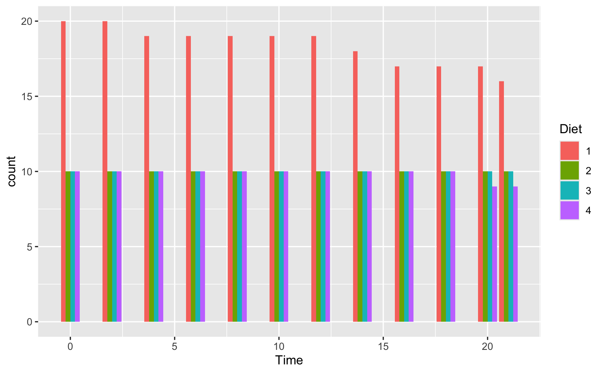

```{r setup, include=FALSE}
knitr::opts_chunk$set(echo = TRUE)
```

## Warm-up

Assume the following definitions for a survey:

-   A person with an age from 1 to 17 years is classified as a minor;

-   a person with an age from 18 to 64 years is classified as an adult;

-   a person with an age from 65 to 99 years is classified as a senior.

Generate a vector with 100 random samples that specifies the age of 100 people (in years), but contains exactly 20 minors, 50 adults, and 30 seniors.

```{r}
minors <- sample(1:17, 20, replace = TRUE)
adults <- sample(18:64, 50, replace = TRUE)
seniors <- sample(65:99, 30, replace = TRUE)
ages <- c(minors, adults, seniors)
```

Now use some functions on your age vector to answer the following questions:

1.  What is the average (mean), minimum, and maximum age in this sample?

```{r}
summary(ages)
```

2.  How many people are younger than 25 years?

```{r}
population <- data.frame(ages)
under_25 <- population %>%
  filter(ages < 25)
```

3.  What is the average (mean) age of people older than 50 years?

```{r}
over_50 <- population %>% 
  filter(ages > 50)
mean(over_50$ages)
```

4.  How many people have a round age (i.e., an age that is divisible by 10)? What is their mean age?

```{r}
round_age <- population %>% 
  filter(ages %% 10 == 0) # what remains after diving by 10
mean(round_age$ages)
```

## Exercise 1: Strange histograms

The following plot shows the distribution of fuel economy in city environments, but adds a frequency polygon as a 2nd geom (see ?geom_freqpoly).

```{r}
data(mpg)

ggplot(mpg, aes(x = cty)) +    # set mappings for ALL geoms
  geom_histogram(aes(x = cty), binwidth = 2, fill = "gold", color = "black") +
  geom_freqpoly(color = "steelblue", size = 2) +
  labs(title = "Distribution of fuel economy", 
       x = "Miles per gallon (in city)",
       caption = "Data from ggplot2::mpg") +
  theme_light()
```

1.  Why is the (blue) line of the polygon lower than the (yellow) bars of the histogram?
Because it shows a range

2.  Change 1 argument in the code so that both (lines and bars) have the same heights.
change size to binwidth

3.  The code above repeats the aesthetic mapping aes(x = cty) in 2 locations. Which of these can be deleted without changing the resulting graph? Why?

4.  Why can't we simply replace geom_freqpoly by geom_line or geom_smooth to get a similar line?

## Exercise 2: Chick diets

The ChickWeight data (contained in the datasets package of R) contains the results of an experiment that measures the effects of Diet on the early growth of chicks.

1.  Save the ChickWeight data as a tibble chick_weight and inspect its dimensions and variables.

```{r}
data("ChickWeight")
```

2.  Create a line plot showing the weight development of each individual chick (on the y-axis) over Time (on the x-axis) for each Diet (in 4 different facets).

3.  The following bar chart shows the number of chicks per Diet over Time. We see that the initial Diet groups contain a different number of chicks and some chicks drop out over Time. Try re-creating this plot (with geom_bar and dodged bar positions).


